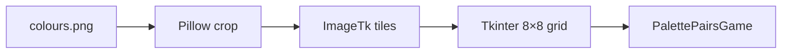

<div align="center">

# Palette Pairs

### Memory match game with pixel-art tiles

[](https://www.python.org/)
[]()
[](https://python-pillow.org/)

<br/>

[]()
[]()
[]()

<br/>

[](https://github.com/hackerbotfz/Python-Games/commits)
[](https://github.com/hackerbotfz/Python-Games)
[](https://github.com/hackerbotfz/Python-Games/stargazers)

<br/>

**[Faiz Lawan](https://github.com/hackerbotfz)**

</div>

---

**Palette Pairs** is a desktop memory game: flip tiles on an 8×8 board, find matching pixel-art sprites, and clear all 32 pairs in as few tries as possible. Built with **Python**, **Tkinter**, and a single spritesheet asset.

## Overview

| Detail | Value |
|--------|--------|
| **Board** | 64 hidden tiles (8×8) |
| **Goal** | Match all 32 sprite pairs |
| **Feedback** | Live score and try counter; win banner at completion |
| **Assets** | Sprites cropped from `assets/colours.png` |

Click a tile to reveal it; click a second to check for a match. Wrong pairs flip back after a short delay.

## Architecture



`PalettePairsGame` owns deck generation, input handling, match detection, and HUD updates. Assets resolve relative to the project via `pathlib` — no hard-coded machine paths.

## Tech stack

Python · Tkinter · Pillow

## Run

```bash
pip install -r requirements.txt
python main.py
```

## Repository

```
python_games/
├── main.py
├── requirements.txt
├── assets/
│   └── colours.png
└── README.md
```

## License

© Faiz Lawan.
